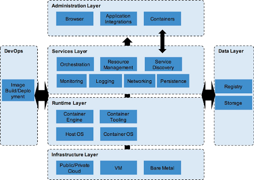
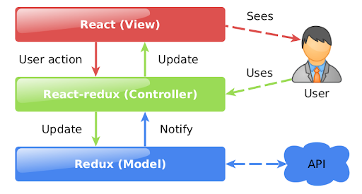
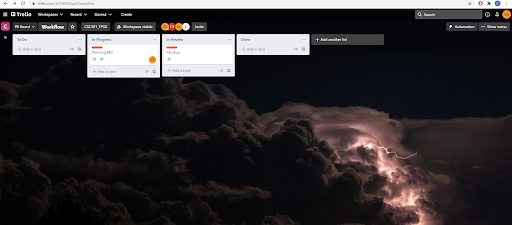

# Silicon_Artists

Google Doc version can be accessed [here](https://docs.google.com/document/d/1cdKVrrKk6MZdjvy1ErjGPwVgSyU_kJML0pkkXo4MGbI/edit?usp=sharing).

## Product Details
 
#### Q1: What are you planning to build?

We are planning to build a website with a backend for the Toronto Police Services Board to allow administrators to record meeting information/minutes and display the information and agendas of these meetings to the general public. The website will help make Board meetings more accessible to the general public in Toronto interested in being engaged more with oversight of the Toronto Police Service Users: Board Administrator / Board Members. 

Currently the partner is using a 300-page long PDF to record this information and modifying it using Joomla CMS. This process is labour intensive and not very accessible to the public. The product will allow for all the information to be displayed clearly and for administrators to update and add to the information easily.

Feature requirements from partner: 
https://docs.google.com/document/d/1OiMUVkmLtp8k1CTZHFGiqfV4dzAGzjcG/edit?usp=sharing&ouid=101500265431798349247&rtpof=true&sd=true

In addition to these features, we need to generate a minutes file for each meeting (see https://tpsb.ca/component/jdownloads/send/59-2021/697-july-29 pages 2-17).

#### Q2: Who are your target users?

We will use personas to represent our target users. First we have Diana the Toronto Police Board Administrator. Diana is the primary intended user of the software’s administrative side. Diana is currently the member of the board who manages, uploads and records information related to public facing police board meetings. Some parts of this take a very long time, for both Diana and the computer systems she works with.

Next we have Dubi the Toronto Police Board Technical personnel. Dubi is a member of the police board who is focused on improving and maintaining software for the Toronto police force. 

Finally we have two members of the public: Cassandra and Ian. Cassandra wants to propose a deputation for the next board meeting, which is a request to debate about a particular topic. Ian is simply interested in the police board’s decisions and wants to stay informed or be involved.

#### Q3: Why would your users choose your product? What are they using today to solve their problem/need?

The users will use our product as it will be made specific to their purposes. It will be very similar to their current website and tools, and will be more time efficient than using the current ones. Benefits of our product include saving the public’s time in finding the information, the readability of the information, and saving the administrator a lot of time in managing the information on the website. 

Currently, the administrators are using Joomla CMS, which takes a lot of manual labour to add and edit content and attachments, which then are using another piece of software to process and add to their website, taking up to hours. Also, the current form of the agendas is a 300-page PDF which is difficult to read through.

#### Q4: How will you build it?

We are intending to use a Python backend which significantly utilizes Django. This will interact with the frontend through a REST API. Django will handle interactions with the database, which will be PostgreSQL.

The frontend will use React js, with redux.

We will use docker containers for deployment, building them for front and backend. This will be built and deployed automatically through github actions, and locally on a develop machine for testing. Nginx reverse proxy will be used to provide only a front door to regular web traffic, with the database on a separate server, both being hosted on AWS free tier in the cloud.

(Cloud/Docker architecture from https://accenture.github.io/blog/2016/04/14/the-lightweight-docker-runtime.html)

In terms of design patterns, Django implements inversion of control. Additionally both Django and React with redux are made using MVC architecture style, and we will follow this for the project for the frontend components.

(MVC from https://sudonull.com/post/79895-Honest-MVC-on-React-Redux-Developer-Soft-Blog)

We intend to use Django for authentication, so there is no need for a separate authentication library. 

Unit tests will be run in GithubActions automatically on commit to develop and master. Integration tests will instead be run manually, with the possibility of some crucial parts being run automatically (if applicable). Front-end tests will be run manually only.

#### Q5: What are the user stories that make up the MVP?

Our user stories use the personas (Diana, Dubai, Ian, Cassandra) defined in Q2.

As **Diana**, I want to be able to sign in to the admin site in order to be able to perform edits.

As **Diana**, I want to be able to create, edit, and add to the meeting minutes in order to inform the public about the meeting as it happens.

As **Diana**, I want to be able to create, edit, and add content and attachments to the agenda in order to be able to generate a comprehensive document later.

As **Diana**, I want to be able to publish agenda and meeting minutes information in order to make it public.

As **Diana**, I want to be able to easily compile the agenda into a single or multiple PDF or HTML document(s) in order to save time.

As **Diana**, I want to be able to update the status of the agenda items during the council meeting in order to announce the decisions to the public.

As **Dubi**, I want to have access to the backend in order to resolve any issues with the website’s functioning.

As **Ian**, I want to be able to view or download the entire agenda or a specific item in the agenda in order to inform myself about this item.

As **Ian**, I want to be able to check the status of the meeting minutes as they are made official in order to update myself on the decisions made.

As **Cassandra**, I want to be able to submit a request for a deputation in order to verbally represent my community during a Council Meeting.

As **Cassandra**, I want to be able to see the results of the decisions in the meeting minutes in order to know the results of my deputation.

----
## Intellectual Property Confidentiality Agreement 

Our partner is okay with any open-source license, so we will use the MIT License. This license is very permissive; the only requirements are that re-use of the code has to include the same copyright notice, and that the authors of the code provide no warranty.

----

## Process Details

#### Q6: What are the roles & responsibilities on the team?

Leo will mainly work on the React frontend, but will help with the database, backend, and DevOps if needed. Leo is familiar with GitHub, databases, application backends, Python, and DevOps. Technical weaknesses include little professional work experience, little web development experience, and being less familiar with HTML and JavaScript.

Clifton will be responsible for the React frontend, but will help with the backend and database if needed. Technical strengths include familiarity with Python, experience working with databases and a web app backend, experience with debugging large web apps, and some experience with frontend technologies like JavaScript and React. Technical weaknesses include a lack of experience with frontend development as a whole, lack of experience with Docker, and not being familiar with GitHub Actions.

Marie will work primarily on the backend. She is familiar with Python, C, and C++, and is also familiar with GitHub. She also has experience working in a C++ backend for a web app. Technical weaknesses include a lack of experience with databases and web development, no knowledge of frontend technologies, and no knowledge of CI/CD.

Colin’s responsibilities will be DevOps and the backend. His strengths include familiarity with Python, Django, AWS, Docker, and GitHub Actions. He also has experience with reverse proxies like Nginx and SSL certificates. His weaknesses include less experience with HTML and CSS, almost no experience with JavaScript, limited database experience, and no frontend experience.

Jessie will work on the database and the backend. She is familiar with Python, C, and C++, as well as databases and Java web app backends. She is less familiar with HTML and JavaScript, and has no knowledge of CSS or CI/CD.

#### Q7: What operational events will you have as a team?

We are planning to have recurring meetings with our project partner every two weeks fully online. During each meeting, we will be presenting to the program, showing them what we have built and new features added to the program. After our presentation, we will ask the partner for comments and advice on the current program. 

Aside from meetings with the partner, we also have our own group meetings at least once a week. In the meetings, we mainly discuss the responses to the questions in the deliverable 1 in the current stage. We also summarize the meetings with our partner and discuss how to design the program to meet as well as methods we will use to meet their requirements. Later after we start coding, we will do code review and see how the project is progressing. 

We had a meeting with our partner from 16:30 to 17:30 on Sept. 24th. During the meeting, we started by making brief introductions. After that, we started asking them questions about this project so that we had more insights into it. We then reaffirmed and adjusted our beliefs based on discussion in another meeting on Monday the 4th at 10:30. We agreed then to meet once every two weeks on Monday with the partner. The things we discussed/the questions we asked are linked in this document:
	
https://docs.google.com/document/d/1RzoEhUOoPnh2NV3urYEybGXIbsj15DXImF6_dY7fQs0/edit?usp=sharing  
  
#### Q8: What artifacts will you use to self-organize?

We will use Trello to function as a task board, creating another close to deadlines as a to-do list. We will have tags for higher priority tasks when created in Trello. Priority is displayed by colour, with greens being low, to reds being high priority.

We also will record the details of what occurs in meetings in two google docs; one for regular group meetings, other for partner meetings. 

Status of work is visible based on state in Trello, possibly with additional comments for state of work on larger items. 

We also will keep a to-do list with more specific instructions/focus closer to the deadlines, as Trello will include items which may not be necessary for a particular deliverable.

#### Q9: What are the rules regarding how your team works?

We intend to have a regular weekly meeting, using discord voice channels, and to use discord chat to communicate in between for short updates. Similarly, we plan to have a partner meeting regularly once every two weeks, planning additional meetings as needed. We will communicate with the partner through email, providing updates to them, the TA and the rest of the group as appropriate. This includes before regular meetings to setup the meeting itself.

There will be at least 3 people attending all partner meetings, and at least 4 for each weekly group meeting (with those who cannot attend sending a message update). Attendance in regular meetings will be recorded, so that group members may be contacted/requested to join if there are too many missed. One person on a rotating basis will read and start discussion on the planned topics for a meeting, and record the details of what was discussed and decided, assigning people or commenting as appropriate they will effectively moderate discussion.

In terms of conflicts within the project, disagreements are likely to arise. In such cases where this cannot be resolved through discussion two clear options will be created, and one will be decided upon through majority voting. Non-responsive team members, those who have not responded within 24 hours, or shorter near deadlines, without reason, will be contacted as best as can be done, via email and discord. They will be required to complete some additional work ahead of the due date in the future, and if an exceptionally long time is taken to respond, the TA/professor will be informed as needed. If the case occurs that one member does not perform work, then the TA may be informed, but ultimately the reproach will be done through the reflection on other group members, providing them with significant negative feedback.

----
## Highlights

Some of the biggest highlights of our decision-making process occurred very quickly after looking into design. For example, we realized that we definitely would need a database for the project after initial email communications. In particular, the decision to use Django was a result of this; we had already decided almost immediately to use Python as that was the one language for backend we all knew. We compared it to Java and C++; however, fewer of us know C++ in addition to it being harder to learn, and having only 2 team members fully proficient in Java would mean a lot of inefficiency in initial work. Then, knowing that we needed a database, we looked at the two most major libraries/frameworks to use with python; Flask and Django. We decided on Django between the two because of past experience with Django, and a larger feature set such as database integration and an admin website, which would save us time and bugs in development.
 
Another highlight was after the first meeting, when we were informed that one of the requirements for the MVP was for the frontend to be AODA compliant. This is because our partner is a public-facing government organization. This made us consider fronted options, and we found that React has considerable documentation on making it accessible. Thus this insight led us to decide on our frontend framework, and will guide how we design the frontend using React.
 
We also found after our first meeting with our partner that the generation of agenda and minute PDFs only happens about once a month. This meant that slow generation of the compiled PDF is not an issue, which we were concerned about after finding that each combined PDF would be about at least 300 pages long. This also means that we do not need to worry about the efficiency of our backend language as much, so using a language like C++ would not be necessary for quick PDF generation.
 
After some discussion on communication methods for deadlines and convenience, one of the group members suggested Trello. After looking at it and realising it fit with our need and wants of simplicity, we decided to use it after having exhausted our other options as not optimal. In particular, we had already considered GitHub issues, Google Docs and a channel in our Discord server as alternatives. These alternatives could work, but they would tend to get messy and difficult to navigate as the project goes on.
 
Finally, we decided after our experience with DevOps in A1 that we would want to use Docker containers for deployment. Docker is OS-agnostic, which gives it flexibility in deployment and for when we hand off the project to our partner. Additionally, Docker makes deployment very easily reproducible once it is set up. This is important for getting the product out and working in a consistent manner, which will likely help with testing and debugging. Additionally, Docker integrates with existing Github Actions scripts well, which is optimal for our purposes in this project. 
